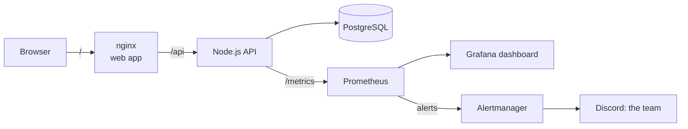
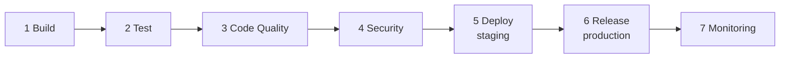

# EventTix

An event ticket booking system with a complete **Jenkins CI/CD pipeline**, built for the SIT223/SIT753 High Distinction task.

Users browse events and book tickets, and admins manage events. The application is deliberately realistic (roles, business rules, a database, concurrency control) so that the pipeline has real work to build, test, scan, deploy, release and monitor.

## Architecture



## The pipeline

Every push to `main` is picked up by Jenkins and runs seven stages automatically. A failure in any stage stops the pipeline, so a bad build never reaches production.



| # | Stage | What it does | Tools | Fails the build when |
|---|-------|--------------|-------|----------------------|
| 1 | **Build** | Builds versioned Docker images (`1.0.0.<build>`), records the commit | Docker | the image does not build |
| 2 | **Test** | 189 unit and integration tests against a throwaway PostgreSQL, with coverage | Jest, Supertest | a test fails or coverage is under 80% |
| 3 | **Code Quality** | Type check, lint, and a SonarQube analysis against a quality gate defined as code | TypeScript, ESLint, SonarQube | the gate fails (coverage, duplication, A ratings, hotspots) |
| 4 | **Security** | Scans dependencies, both images, and the source for secrets and unsafe Dockerfile settings; documented exceptions expire | npm audit, Trivy | a fixable HIGH or CRITICAL finding remains |
| 5 | **Deploy** | Starts the build in staging from Compose files, runs a smoke test with a real booking, rolls back on failure | Docker Compose | the smoke test fails (the previous version is restored) |
| 6 | **Release** | Stores the images in a registry, tags the commit, publishes a GitHub release, deploys the same images to production | Docker registry, Git, GitHub API | any step fails |
| 7 | **Monitoring** | Deploys Prometheus, Alertmanager and Grafana, unit-tests the alert rules, proves production is being watched, notifies the team | Prometheus, Alertmanager, Grafana, Discord | a check fails |

## Environments

| What | Address |
| ---- | ------- |
| Production web app / API | http://localhost:8082 / http://localhost:3002 |
| Staging web app / API | http://localhost:8081 / http://localhost:3001 |
| Jenkins | http://localhost:8083 |
| SonarQube (code quality) | http://localhost:9000 |
| Grafana (dashboard) | http://localhost:3030 |
| Prometheus (alert rules) | http://localhost:9090/alerts |
| Alertmanager | http://localhost:9093 |
| Image registry | http://localhost:5000/v2/_catalog |

## Documentation

| Guide | What it covers |
| ----- | -------------- |
| [`docs/SETUP.md`](docs/SETUP.md) | Clone the repository and set the whole pipeline up from scratch |
| [`docs/DEMO.md`](docs/DEMO.md) | Demonstrate rollback and incident alerts; evidence checklist |
| [`backend/README.md`](backend/README.md) | The API, business rules, tests |
| [`frontend/README.md`](frontend/README.md) | The web app |
| [`monitoring/README.md`](monitoring/README.md) | Metrics, alert rules, incident simulation |
| [`security/README.md`](security/README.md) | How security exceptions are documented |

## Repository layout

```
backend/      Node.js + Express + PostgreSQL API, with tests and Dockerfile
frontend/     React single-page app, served by nginx
deploy/       Staging and production environments as code (Compose + settings)
monitoring/   Prometheus, Alertmanager, Grafana as code
jenkins/      Jenkins, SonarQube and the registry, as code
scripts/      Pipeline scripts (deploy, release, security, quality gate, smoke test, simulation)
security/     Documented security exceptions
Jenkinsfile   The pipeline
```

## Run the application locally (without Jenkins)

You need [Docker Desktop](https://www.docker.com/products/docker-desktop/).

```
copy .env.example .env      (then replace every CHANGE-ME value)
docker compose up --build
```

Open http://localhost:8080. Run the backend tests with `cd backend && npm install && npm run test:unit`.
